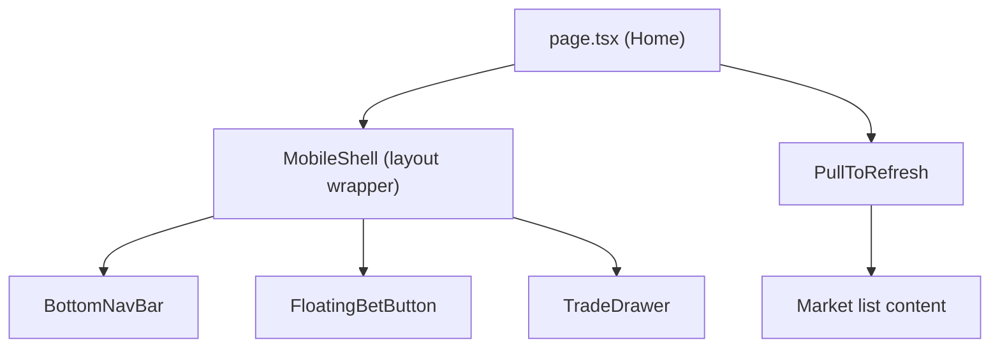

# Design Document: Mobile Navigation Shell

## Overview

This document describes the design for a mobile-first navigation shell for Stella Polymarket. The shell is optimized for Thumb-Zone ergonomics, targeting the 80% of users in the Global South who access the app on mobile devices. The implementation uses React/Next.js with Tailwind CSS and adds no new runtime dependencies beyond what already exists in the project.

The shell consists of four components:
1. `BottomNavBar` — fixed 4-tab navigation
2. `FloatingBetButton` — FAB above the nav bar
3. `TradeDrawer` — swipeable bottom sheet
4. `PullToRefresh` — pull-down gesture wrapper

---

## Architecture



The `MobileShell` component wraps the page and renders the persistent chrome (nav bar, FAB, drawer). It owns the `activeTab`, `activeMarket`, and `drawerOpen` state. The `PullToRefresh` component wraps the scrollable market list independently.

---

## Components and Interfaces

### BottomNavBar

```ts
interface BottomNavBarProps {
  activeTab: 'home' | 'search' | 'portfolio' | 'profile';
  onTabChange: (tab: 'home' | 'search' | 'portfolio' | 'profile') => void;
}
```

- Fixed position, `bottom-0`, full width
- `pb-[env(safe-area-inset-bottom)]` for home bar clearance
- 4 items: Home (house icon), Search (magnifier), Portfolio (chart), Profile (person)
- Active tab gets `text-blue-400` + underline indicator

### FloatingBetButton

```ts
interface FloatingBetButtonProps {
  activeMarket: Market | null;
  drawerOpen: boolean;
  onPress: () => void;
}
```

- Absolutely positioned, centered horizontally, `bottom` offset = nav bar height + 16px
- 56×56px circle, `bg-blue-600`
- Disabled (opacity-40, pointer-events-none) when `activeMarket` is null
- Hidden (`opacity-0 pointer-events-none`) when `drawerOpen` is true
- Transitions: `transition-opacity duration-200`

### TradeDrawer

```ts
interface TradeDrawerProps {
  market: Market | null;
  open: boolean;
  onClose: () => void;
}
```

- Fixed bottom sheet, full width, `max-h-[80vh]`
- Drag handle: 32×4px rounded pill at top center
- Swipe-to-close: tracks `touchstart`/`touchmove`/`touchend` on the handle
  - Threshold: 30% of drawer height
  - Uses `transform: translateY(${dragY}px)` during drag
  - On release: if dragY > threshold → close (animate out), else snap back
- `pb-[env(safe-area-inset-bottom)]` on inner content
- Backdrop overlay dims the page when open

### PullToRefresh

```ts
interface PullToRefreshProps {
  onRefresh: () => Promise<void>;
  children: React.ReactNode;
}
```

- Wraps scrollable content
- Tracks `touchstart`/`touchmove`/`touchend`
- Shows spinner when pull distance > 0, triggers refresh at 60px threshold
- Prevents concurrent refreshes via `isRefreshing` flag
- Spinner animates in/out with CSS transition

---

## Data Models

No new data models are introduced. The existing `Market` interface from `page.tsx` is reused:

```ts
interface Market {
  id: number;
  question: string;
  end_date: string;
  outcomes: string[];
  resolved: boolean;
  winning_outcome: number | null;
  total_pool: string;
  status?: string;
}
```

Tab type:
```ts
type NavTab = 'home' | 'search' | 'portfolio' | 'profile';
```

---

## Correctness Properties

*A property is a characteristic or behavior that should hold true across all valid executions of a system — essentially, a formal statement about what the system should do. Properties serve as the bridge between human-readable specifications and machine-verifiable correctness guarantees.*

**Property 1: Active tab exclusivity**
*For any* NavTab value passed as `activeTab`, exactly one tab in the BottomNavBar should have the active visual indicator applied, and all other tabs should not.
**Validates: Requirements 1.2, 1.5**

**Property 2: FAB disabled when no active market**
*For any* render of FloatingBetButton where `activeMarket` is null, the button element should have the disabled attribute or `pointer-events-none` class applied.
**Validates: Requirements 2.3**

**Property 3: FAB hidden when drawer is open**
*For any* render of FloatingBetButton where `drawerOpen` is true, the button should have `opacity-0` or equivalent hidden styling applied.
**Validates: Requirements 2.5**

**Property 4: Drawer close on sufficient drag**
*For any* drag distance greater than 30% of the drawer's rendered height, releasing the gesture should result in `onClose` being called.
**Validates: Requirements 3.2**

**Property 5: Drawer snap-back on insufficient drag**
*For any* drag distance less than 30% of the drawer's rendered height, releasing the gesture should result in the drawer remaining open (onClose not called).
**Validates: Requirements 3.3**

**Property 6: FAB restored after drawer close**
*For any* sequence of open-then-close on the TradeDrawer, the FloatingBetButton should transition from hidden to visible after close completes.
**Validates: Requirements 3.5**

**Property 7: Pull-to-refresh threshold**
*For any* pull distance greater than or equal to 60px, the `onRefresh` callback should be invoked exactly once.
**Validates: Requirements 4.2**

**Property 8: Refresh idempotence**
*For any* state where a refresh is already in progress, initiating a second pull-to-refresh gesture should not invoke `onRefresh` a second time.
**Validates: Requirements 4.4**

---

## Error Handling

- If the market data fetch fails during pull-to-refresh, the loading indicator is hidden and the existing market list is preserved (no blank state).
- If `activeMarket` becomes null while the drawer is open, the drawer closes automatically.
- Touch events that start outside the drag handle do not trigger swipe-to-close.

---

## Testing Strategy

### Unit Tests (Jest + React Testing Library)

Unit tests cover specific rendering examples and interaction examples:
- BottomNavBar renders all 4 tabs with correct labels
- BottomNavBar applies active class to the correct tab
- FloatingBetButton renders disabled when no market
- FloatingBetButton renders hidden when drawer is open
- TradeDrawer renders drag handle
- TradeDrawer calls onClose when swiped past threshold
- PullToRefresh shows spinner on pull, calls onRefresh at threshold

### Property-Based Tests (fast-check)

The property-based testing library is **fast-check** (`fast-check` npm package). Each property test runs a minimum of 100 iterations.

Each property-based test is tagged with the format:
`// Feature: mobile-navigation-shell, Property {N}: {property_text}`

Properties to implement:

- **Property 1** — For all NavTab values, active tab exclusivity holds
- **Property 2** — For all null activeMarket renders, FAB is disabled
- **Property 3** — For all drawerOpen=true renders, FAB is hidden
- **Property 4** — For all drag distances > 30% height, drawer closes
- **Property 5** — For all drag distances < 30% height, drawer snaps back
- **Property 6** — Open-then-close round trip restores FAB visibility
- **Property 7** — For all pull distances >= 60px, onRefresh called once
- **Property 8** — Concurrent refresh prevention (idempotence)

Both unit tests and property tests are complementary: unit tests catch concrete rendering bugs, property tests verify behavioral invariants across all input combinations.
