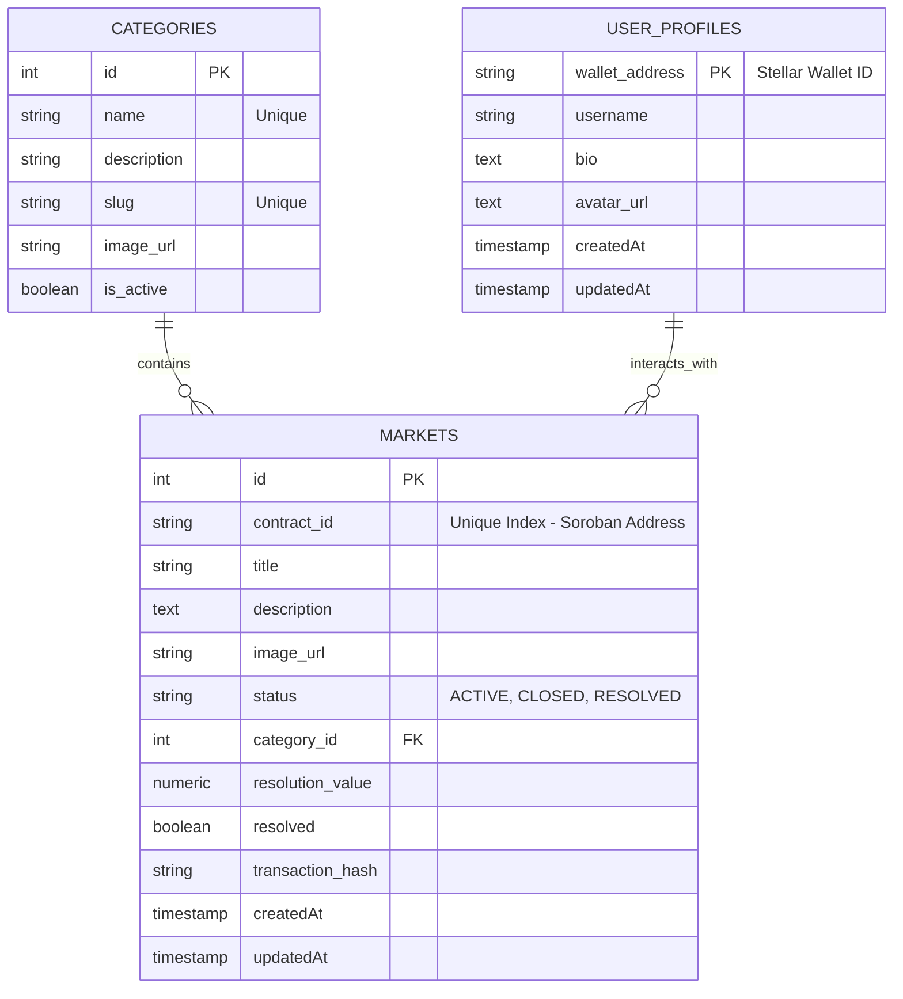

# Database Entity Relationship Diagram (ERD)

This document describes the relational database schema used for storing "Rich Metadata" (categories, long-form descriptions, image pointers) for the Stellar-PolyMarket prediction market system.

While critical "Money" operations (bets, payouts) occur on the Stellar blockchain via Soroban smart contracts, the rich user experience data is maintained in a Postgres relational database to minimize on-chain storage costs.

## Schema Visualization

## Key Mapping

- **Markets Table**: Uses the **Soroban Contract_ID** as a unique index (`contract_id_idx`). This allows for quick lookup and synchronization between on-chain market contracts and off-chain rich metadata.
- **Rich Metadata Strategy**: Image pointers (URLs) and long-form descriptions are stored in Postgres to allow for rich text, markdown descriptions, and high-resolution thumbnail caching, which would be prohibitively expensive to store on the Stellar ledger.

## Migration Tooling

The schema is managed using **Drizzle ORM** with `drizzle-kit` for automated migrations and type-safe database access in the backend service.

### Primary Tables
1. **Markets**: Core market information linked to Soroban contracts.
2. **Categories**: Organized taxonomy for market discovery.
3. **UserProfiles**: Rich metadata for Stellar wallet holders (bio, avatar, username).
